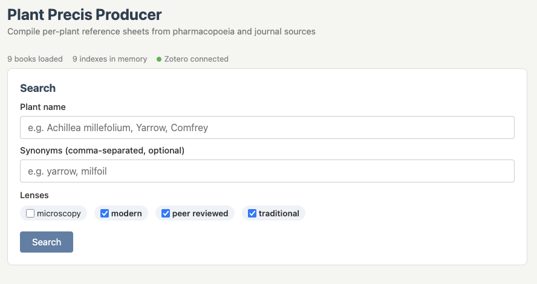

<div align="center">
  
  <h1>Plant Precis Producer</h1>
  <p><em>Compile per-plant reference sheets from pharmacopoeia and journal sources</em></p>
</div>

---

## Hey. We need to talk about your workflow.

You're a modern herbalist. You've got all these PDFs — Felter, King's, Ellingwood, Potter's, that AHP monograph you paid actual money for, three Wichtl editions in two languages — and then there's your Zotero library, which at this point is basically a second career. Hundreds of peer-reviewed papers, lovingly tagged, sitting there full of alkaloid profiles and clinical outcomes and ethnobotanical edge cases.

And when you want to look up a specific plant?

You open six PDFs. You Ctrl+F. You lose the thread in King's American Dispensatory because that thing is three thousand pages long and the index is in the back and the page numbers don't match the PDF pages. You tab over to Zotero. You search. You get fourteen results. You open them. You lose the thread again. You check your notes from last semester. The notes are in a folder called "Herbs Final?" on a desktop you no longer have.

That's so, like, *last century*, man.

Plant Precis Producer takes your plant name, reaches into all of your sources simultaneously — traditional pharmacopoeias, modern references, your entire Zotero library, loose PDFs in whatever folder you've been dumping them into — and compiles a single, lens-organized reference document. Traditional sources grouped together. Peer-reviewed separately. Microscopy if you need it. One PDF, table of contents included, ready in seconds.

It runs locally. Your books stay on your machine. Nothing is uploaded anywhere. It's just you, your library, and significantly less yak-shaving.

<div align="center">
  
  <br/>
  <em>The full interface — search by plant name, select lenses, compile.</em>
</div>

---

## Installation

Works on macOS, Linux, and Windows. Pick whichever option matches your comfort level.

### Option A — Let Claude Cowork install it for you

If you have [Claude Desktop](https://claude.ai) with Cowork, you don't need to touch a terminal. The repository includes a [`COWORK_INSTALL.md`](COWORK_INSTALL.md) workflow that Cowork can follow:

1. **Open Claude Desktop** and start a Cowork session.
2. **Tell it:** *"Install Plant Precis Producer from https://github.com/johncourie/plant-precis-producer — follow the COWORK_INSTALL.md workflow"*
3. Cowork will walk through six supervised steps — checking Python, installing poppler, installing dependencies, writing configs, verifying the install, and launching the server. **Each step pauses for your permission** before doing anything to your system.
4. When done, the browser opens to the setup page at `http://localhost:7734/setup`.

If something fails, Cowork can safely re-run that step — each one checks what's already done before doing anything.

On first launch, the setup page will ask you:
- Whether you want to connect your Zotero library (auto-detected if installed)
- Whether you have any other PDF directories you want to include

Both are configured through the browser — no config file editing required.

---

### Option B — Claude Code users

If you already have [Claude Code](https://claude.ai/claude-code) running, you can install and manage Plant Precis Producer from within your Claude Code session.

**To install:**

Open Claude Code and paste this prompt:

```
Clone https://github.com/johncourie/plant-precis-producer, install its
dependencies (poppler and the Python packages), copy the example config
files to their working names, and start the local server. Then open
localhost:7734 in my browser.
```

Claude Code will handle the setup and tell you if anything needs your attention.

**To add your books:**

Put your PDFs in the `plant-precis-producer/` folder on your machine. Then tell Claude Code:

```
Index the new book I added to plant-precis-producer — it's called
[filename.pdf]. It's a [modern / traditional / peer-reviewed] source.
The author is [Author Name], the year is [Year], and the title is
[Book Title].
```

Claude Code will probe the PDF, find the index pages, build the citation template, extract the index, and register the book. You don't need to know what any of that means.

**To start it again later:**

```
Start the Plant Precis Producer server and open it in my browser.
```

---

### Option C — Command line install

For users comfortable with a terminal.

#### Prerequisites

- Python 3.9+
- **poppler** (provides `pdftotext`):
  - macOS: `brew install poppler`
  - Ubuntu/Debian: `sudo apt install poppler-utils`
  - Windows: `scoop install poppler` or `conda install -c conda-forge poppler`

#### Install

```bash
git clone https://github.com/johncourie/plant-precis-producer.git
cd plant-precis-producer
pip install -e .
cp books.example.json books.json
cp config.example.json config.json
```

On macOS/Linux you can also run `make setup`, which does the `pip install` step and reminds you to copy the config files.

#### Run

```bash
python3 start.py
```

This starts the local server and opens `http://localhost:7734` in your browser. Works on every platform.

On macOS/Linux you can also use `make serve` or `./start.sh` — they do the same thing.

#### Configure Zotero and external directories

Edit `config.json`:

```json
{
  "zotero": {
    "enabled": true,
    "db_path": "~/Zotero/zotero.sqlite",
    "storage_path": "~/Zotero/storage",
    "priority_collections": ["Herbs"]
  },
  "external_dirs": [
    {
      "path": "~/Documents/herb-papers",
      "lens": ["peer_reviewed"]
    }
  ]
}
```

The Zotero `db_path` depends on your operating system. Common locations:

| Platform | Typical path |
|---|---|
| macOS | `~/Zotero/zotero.sqlite` |
| Linux | `~/Zotero/zotero.sqlite` |
| Linux (Flatpak) | `~/.var/app/org.zotero.Zotero/data/zotero/zotero.sqlite` |
| Windows | `C:\Users\<you>\AppData\Roaming\Zotero\Zotero\zotero.sqlite` |

Not sure where yours is? In Zotero, go to Edit > Settings > Advanced > Files and Folders > Data Directory Location. The database is `zotero.sqlite` inside that directory. The setup page at `/setup` will also try to auto-detect it for you.

If you're using the web UI, external directories are indexed automatically when you click **Save & Continue** on the setup page. If you prefer the command line, you can also scan manually:

```bash
python3 scan_external.py
```

#### Adding a new book (CLI)

```bash
# Phase 1: find the index/TOC pages
python3 index_new_book.py "New Book.pdf" --id newbook --probe-only

# Phase 2: extract and register
python3 index_new_book.py "New Book.pdf" \
    --id newbook \
    --short-name "NewBook" \
    --index-pages 5-12 \
    --lens "modern" \
    --citation "Author. (Year). Title. pp. {pages}."
```

---

## Usage

### Starting the app

Once installed, here's how to open Plant Precis Producer:

- **If you used Cowork to install:** Open Claude Desktop and say: *"Start the Plant Precis Producer server and open it in my browser."*
- **If you used Claude Code:** Open Claude Code in the `plant-precis-producer` folder and say: *"Start the Plant Precis Producer server and open it in my browser."*
- **If you're a terminal user:** Run `python3 start.py` from the project folder.

In all cases, a page opens in your browser at `http://localhost:7734`. That's the app. It runs until you close the terminal window or press Ctrl+C.

### First-time setup

The very first time you launch, the app opens to a **Setup** page. Here you can:

1. **Connect Zotero** — If Zotero is installed on your computer, the app will detect it automatically. Flip the toggle to enable it. Your Zotero library is never modified — the app only reads from it.
2. **Add PDF folders** — Click "Add folder", then "Browse..." to navigate to any folder on your computer that contains PDFs you want to search. You can add as many folders as you want. The files stay where they are.
3. Click **Save & Continue** — the app will automatically index any new PDFs in your folders. You'll see live progress as each file is processed (name, page count). Once indexing finishes, you're taken to the search page.

You can always get back to setup later by clicking "Setup" in the top-right corner of the search page. Re-saving will only index PDFs that haven't been indexed yet — it won't re-process existing ones.

### Searching and compiling

1. **Type a plant name** — common name (Yarrow), Latin name (Achillea millefolium), or drug name (Millefolii herba) all work.
2. **Check the lenses** you want — traditional, modern, peer-reviewed, microscopy. Check all of them if you want everything.
3. **Click Search** — the app searches all your books and (if enabled) your Zotero library.
4. **Review the results** — they're grouped by lens. Each result shows the book name and the matching index entry. Adjust the page ranges if needed.
5. **Click Compile Precis** — a PDF downloads to your computer. Compilation usually takes 5–30 seconds depending on how many sources you selected. Larger sources like King's (2,977 pages) take longer. The app will tell you it's working — it hasn't crashed, it's just reading a lot of pages.

That's it. You now have a single reference document for that plant, compiled from all your sources.

### What you get

The output is a single PDF named `PlantName_precis.pdf`:

- **Page 1** is a generated table of contents listing every source, grouped by lens (Traditional, Modern, Peer-Reviewed, Microscopy), with page numbers.
- **Remaining pages** are the actual extracted pages from each source, appended in lens order.
- **Typical size** is 5–30 pages depending on how many sources and lenses you select. A plant with entries in all four included texts plus a few Zotero papers might produce a 15–25 page document.
- The file is also saved in the `precis/` folder in the project directory.

---

## Included public domain texts

Four texts ship with the repository, pre-indexed and ready to use:

| Book | Author | Year |
|---|---|---|
| Potter's Cyclopaedia of Botanical Drugs | R.C. Wren | 1907 |
| American Materia Medica, Therapeutics and Pharmacognosy | F. Ellingwood | 1919 |
| The Eclectic Materia Medica, Pharmacology and Therapeutics | H.W. Felter | 1922 |
| King's American Dispensatory | H.W. Felter & J.U. Lloyd | 1898 |

---

## Lenses

Each source is tagged with one or more lenses that describe its perspective:

| Lens | Description | Examples |
|---|---|---|
| `traditional` | Historical/eclectic texts (pre-1930) | Ellingwood, Felter, King's, Potter's |
| `modern` | Contemporary pharmacopoeias | AHP, BHP, Wichtl, EP |
| `peer_reviewed` | Journal articles | Zotero library, external papers |
| `microscopy` | Microscopy atlases | AHP, Atlas (Jackson) |

The compiled précis groups sources by lens in the table of contents.

---

## How it works

1. **`books.json`** — Registry of all source books with lens tags, page offsets, and citation templates.
2. **`config.json`** — System settings: Zotero path, external directories, lens definitions.
3. **`_indexes/`** — Pre-extracted text indexes loaded into memory at startup for fast plant lookup. Never rebuilt per-request.
4. **`compile_precis.py`** — Takes a manifest, extracts pages from PDFs, compiles into a single PDF with a lens-grouped table of contents.
5. **`zotero_scan.py`** — Searches Zotero's SQLite database read-only.
6. **`scan_external.py`** — Scans external directories and registers PDFs. Called automatically by the web UI on save; also usable as a standalone CLI tool.

---

## Troubleshooting

**Server won't start / "address already in use"**
Another process is using port 7734. Check if you already have Plant Precis Producer running in another terminal. To find what's using the port: `lsof -i :7734` on macOS/Linux, or `netstat -ano | findstr 7734` on Windows.

**"pdftotext not found"**
poppler isn't installed. Head back to the Prerequisites section — there's a one-liner for your platform.

**Compilation seems stuck**
It's probably not stuck — it's reading pages. King's American Dispensatory alone is nearly 3,000 pages. Give it up to a minute for large compilations. If it's truly frozen (no activity for 2+ minutes), stop the server with Ctrl+C and try again.

**Empty PDF / "No pages were extracted from any source"**
The page ranges are wrong. The printed page numbers in a book's index don't always match the PDF page numbers — that's what the `page_offset` in `books.json` corrects. Try adjusting the page range in the search results before compiling.

**Zotero shows "not detected" on the setup page**
The app couldn't find your Zotero database at the default path. This is common on Linux (Flatpak installs use a different directory) and Windows. In Zotero, go to Edit > Settings > Advanced > Files and Folders to find your actual data directory, then update the path on the setup page or in `config.json`. See the Zotero path table above.

**Zotero connected but returns no results**
Zotero search works in three tiers: collection name, then title, then full-text. If your papers aren't in a collection matching the plant name, try searching by Latin binomial. Also make sure Zotero has finished indexing your PDFs — open Zotero and let it run for a bit if you recently added papers.

**Search returns no results for a plant I know is in my books**
Plants can be indexed under different names — Latin binomial, common name, drug name, or a synonym. Try a few variations. You can also check the book's index file directly in the `_indexes/` folder to see exactly how entries are spelled.

**Permission error running start.sh (macOS/Linux)**
Run `chmod +x start.sh`, or just use `python3 start.py` instead — it does the same thing and works everywhere.

---

## License

Code: GPL-3.0 — see [LICENSE](LICENSE).
Included public domain texts are not subject to copyright restrictions.
